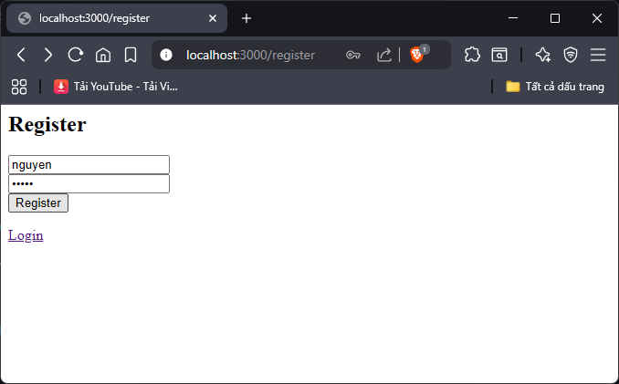
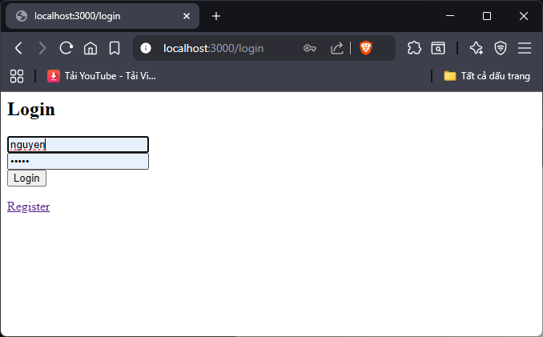
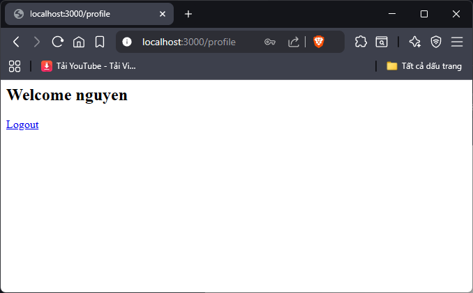

4. local_passport_website
Local Passport Website
Giới thiệu

Dự án website sử dụng Passport Local cho xác thực người dùng.

Cách chạy

Cài dependency: npm install

Chạy: node app.js

Mở browser: http://localhost:3000

Hướng dẫn test

Đăng ký trên web

Đăng nhập trên web

Vào trang Profile

Logout

## 📸 Kết quả test

### 1. Register

### 2. Login

### 3. Profile
